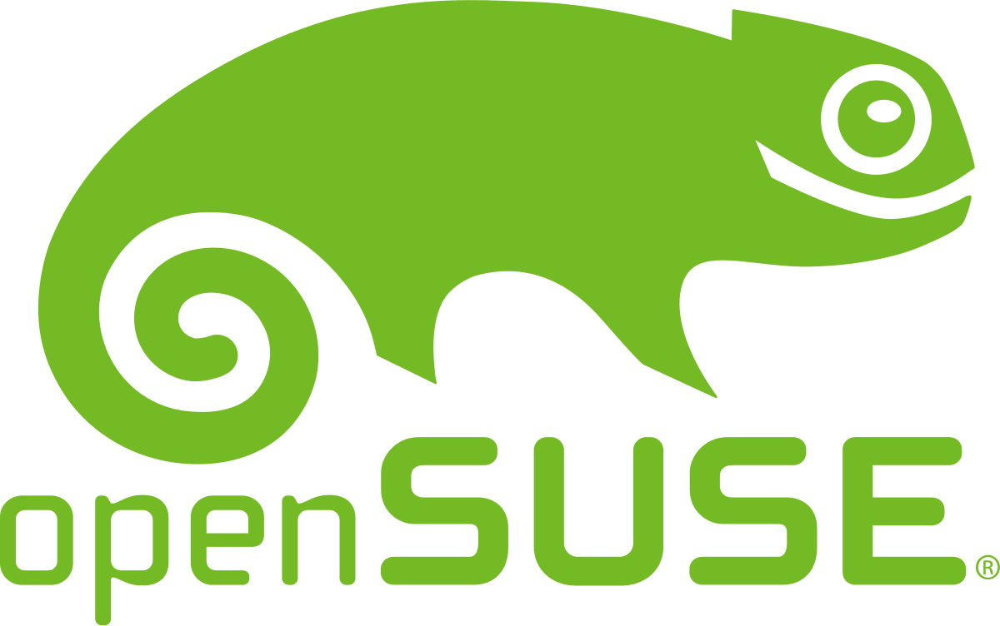

<h4 align="center">

</h4>

<h2 align="center">
Heya, I'm User7558!
</h2>

<h4 align="center">

 
   
   
   
  
 

</h4>

I'm a CyberSecurity Enthusiast, currently pursuing higher education in **Computer Science** under **IFSP**, Brazil. 

With a strong background in **programming** and **ethical hacking**, I'm learning and specializing in testing and evaluating the security of a software, hardware or company, so the world can be a more secure place for everybody.

Looking to collaborate with cybersecurity python and C projects! You can reach me by my <a link="https://www.linkedin.com/in/maria-luiza-5420a2242/">LinkedIn</a>.

---
<h2>Dev-Hub</h2>

>Programming languages
<table>
  <tr>
    <td align="center" width="96">
      
       Bash
    </td>
    <td align="center" width="96">
      
       Python
    </td>
    <td align="center" width="96">
      
       C
    </td>
    <td align="center" width="96">
      
       markdown
    </td>
     <td align="center" width="96">
      
       HTML
    </td>
  </tr>
</table>

>Frameworks and libraries
<table>
  <tr>
    <td align="center" width="96">
      
       Arduino
    </td>
     <td align="center" width="96">
      
       Wordpress
    </td>
    </tr>
</table>

>Operating system
<table>
  <tr>
    <td align="center" width="96">
      
       Windows
    </td>
    <td align="center" width="96">
      
       OpenSuse
    </td>
    <td align="center" width="96">
      
       kali
    </td>
    <td align="center" width="96">
      
       ARCH
    </td>
    <td align="center" width="96">
      
       android
    </td>
    </tr>
</table>

>Software and tools
<table>
  <tr>
    <td align="center" width="96">
      
       nmap
    </td>
    <td align="center" width="96">
      
       Git
    </td>
    <td align="center" width="96">
      
       wiershark
    </td>
    <td align="center" width="96">
      
       Visual Studio
    </td>
    <td align="center" width="96">
      
       Sublime
    </td>
    </tr>
</table>

<!-- GitHub fun things-->

<h2>GitHub Stats</h2>

|  |  |  |
| :-: | :-: | :-: |

|  |  |
| :-: | :-: |

***Learning new technologies everyday to become better than my past self.***
